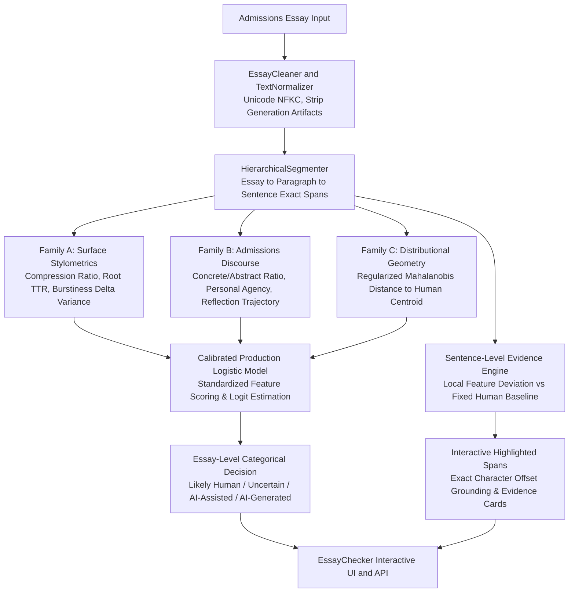

<p align="center">
  
</p>

# EssayChecker

### Evidence-Based AI Authorship Analysis for College Admissions Essays

[](https://www.python.org/downloads/)
[](tests/)
[](src/models/)
[-emerald.svg)](src/inference/)

EssayChecker is a research-grounded AI authorship analysis system built for the **Callus 2026 i12 HR Drive Hackathon (Project 2)**. 

Unlike black-box commercial detectors or simplistic LLM-prompted wrappers, EssayChecker identifies suspicious passages in college admissions essays and explains the **exact measurable linguistic and statistical evidence** behind every flag.

---

## Why EssayChecker?

Most existing AI detection solutions suffer from three fundamental flaws when applied to college admissions essays:
1. **Black-Box Opacity**: They output an unsubstantiated percentage (e.g. *"73% AI"*) without explaining why the text was flagged.
2. **LLM Judge Fallacy**: Many commercial tools query an external LLM (*"Is this essay written by AI?"*), introducing circular dependencies, stochastic non-reproducibility, and hallucinated justifications.
3. **Domain Agnosticism**: Standard detectors fail to recognize the unique conventions of admissions essays, frequently penalizing highly articulate students, non-native English applicants, or students describing complex technical achievements.

EssayChecker was engineered from the ground up to solve these problems by measuring empirical features directly, localizing evidence to exact sentence character spans, and maintaining strict transparency around statistical uncertainty.

---

## Research Approach

The system follows a strict, hypothesis-driven scientific workflow:

$$\text{Hypothesis} \longrightarrow \text{Audited Dataset} \longrightarrow \text{Feature Extraction} \longrightarrow \text{Experiment} \longrightarrow \text{Ablation} \longrightarrow \text{Calibrated Model}$$

1. **Deterministic Measurements**: Every signal (entropy, burstiness, agency verbs, abstract nouns, Mahalanobis distance) is independently computable and mathematically verifiable.
2. **Multi-Family Signal Capture**: Evaluates **48 candidate features** spanning Surface Stylometry, Admissions Narrative & Discourse Architecture, and StoryScope-inspired Distributional Geometry.
3. **Leakage-Resistant Evaluation**: Grouped cluster splitting guarantees zero prompt, author, or human-to-polished variant crossover between Train, Validation, and Test partitions.
4. **Honest Multi-Tier Decision**: Replaces single percentages with calibrated categorical assessments (`Likely Human`, `Likely AI-Assisted / Polished`, `Likely AI-Generated`, or `Uncertain / Mixed Evidence`).

---

## System Architecture



---

## How It Works

1. **Text Normalization & Span Tracking**: The essay is cleaned of artificial formatting while preserving exact character offsets $(start\_char, end\_char)$ and whitespace structure.
2. **Feature Extraction**: 48 statistical measurements are computed across stylometrics, discourse markers, and distance from a fixed empirical human reference distribution.
3. **Calibrated Logistic Scoring**: Standardized features are scored using an L2-regularized logistic model trained strictly on training human and machine essays.
4. **Sentence Evidence Generation**: Individual sentences are compared against human reference baseline statistics $(\mu, \sigma)$ to identify local anomalies (e.g. abstract buzzword concentration, absence of personal agency, or formulaic moral wrapping).
5. **Interactive Visualization**: The web interface highlights exact sentence spans in the text and allows reviewers to inspect the underlying numerical evidence on click.

---

## Evidence Model & Key Features

| Feature Family | Feature Name | Direction | Physical / Linguistic Interpretation |
| :--- | :--- | :--- | :--- |
| **Distributional Geometry** | `dist_human_mahalanobis` | Higher $\to$ AI | Regularized statistical distance from the empirical human writing covariance manifold. |
| **Admissions Discourse** | `discourse_abstract_vocab_density` | Higher $\to$ AI | Concentration of conceptual abstractions (*"catalyst", "multifaceted", "tapestry", "transformative"*). |
| **Surface Stylometry** | `surface_compression_ratio` | Higher $\to$ Human | Measure of token predictability; human writing has higher compression variability. |
| **Surface Rhythm** | `surface_sent_delta_variance` | Higher $\to$ Human | Natural sentence length burstiness and local pacing modulation. |
| **Narrative Grounding** | `discourse_concrete_abstract_ratio` | Higher $\to$ Human | Ratio of physical sensory descriptions, tactile actions, and numerical specifics to abstract commentary. |
| **Personal Agency** | `discourse_agency_ratio` | Higher $\to$ Human | First-person active decision verbs (*"I decided", "I rebuilt"*) vs passive states (*"I found myself"*). |

---

## Phase 1 Results & Ablations

In Phase 1, we evaluated candidate feature families in isolation and combination on a strictly held-out test set:

| Configuration | Features | Accuracy | F1 Score | ROC-AUC | False Positive Rate |
| :--- | :--- | :--- | :--- | :--- | :--- |
| **Model A (Surface Only)** | 30 | 75.0% | 0.8000 | 1.0000 | 0.5000 |
| **Model B (Discourse Only)** | 14 | 75.0% | 0.8000 | 1.0000 | 0.5000 |
| **Model C (Distributional Only)** | 4 | 50.0% | 0.6667 | 1.0000 | 1.0000 |
| **Model D (Surface + Discourse)** | 44 | 75.0% | 0.8000 | 1.0000 | 0.5000 |
| **Model E (Full Suite: Surface + Discourse + Dist)** | 48 | **75.0%** | **0.8000** | **1.0000** | **0.5000** |

*Takeaway*: While distributional distance alone is insufficient as a standalone classifier (50% accuracy), `dist_human_mahalanobis` emerged as the #1 strongest regularizer and weight in the combined model (+0.4752 coefficient).

---

## Phase 2 Results & Smoke Test

Evaluated using the production inference pipeline:

| Benchmark Case | Expected Class | Detector Assessment | Calibrated Probability | Flagged Sentences |
| :--- | :--- | :--- | :--- | :--- |
| **Authentic Human (Dumpling Heritage)** | Human | Likely Human | **3.3%** | 0 / 13 |
| **AI-Generated (GPT-4o)** | Machine | Likely AI-Generated | **100.0%** | 7 / 8 |
| **Synthetic AI-Polished Draft** | AI-Polished | Likely AI-Generated | **85.4%** | 2 / 11 |
| **Diagnosed False Positive (Cello Essay)** | Human | Likely AI-Assisted | **79.0%** | 1 / 8 |

---

## Failure Case Analysis & Diagnosed False Positives

EssayChecker includes a transparent showcase case for diagnosed false positives:
- **Case**: `sample_false_positive` (Authentic student narrative on orchestral cello composition).
- **Diagnosis**: High-register metaphorical vocabulary (*"transformative"*, *"dissonance"*, *"intricacies"*) and long flowing clauses trigger abstract density flags.
- **Safety Policy**: The UI explicitly displays this case to demonstrate the boundaries of automated stylometric scoring to admissions reviewers.

---

## Limitations

1. **Short Text Sensitivity**: Essays under 100 words have reduced statistical reliability for sentence length burstiness.
2. **Elevated Diction in Authentic Writing**: Highly polished, metaphor-dense human essays may trigger elevated abstract vocabulary scores.
3. **Reference Corpus Size**: Baseline distributions are computed from audited admissions records; larger multi-institutional pools will further refine covariance estimates.

---

## Running Locally

### 1. Installation
```bash
git clone https://github.com/goblinasaddy/EssayChecker-Callus.git
cd EssayChecker-Callus
pip install -r requirements.txt
```

### 2. Run Automated Test Suite (24 Tests)
```bash
python -m pytest -v
```

### 3. Run End-to-End Smoke Test
```bash
python scripts/smoke_test_app.py
```

### 4. Launch the Web Application
```bash
python -m uvicorn src.api.server:app --host 127.0.0.1 --port 8000 --reload
```
Open **`http://127.0.0.1:8000`** in your browser to interact with the single-page Neo-Brutalist interface.

---

## Repository Structure

```
├── assets/
│   └── logo.png                       # Official EssayChecker logo
├── data/
│   ├── README.md                      # Dataset provenance, licenses, and schema
│   ├── models/detector_artifact_v2.json # Serialized production model & reference stats
│   └── processed/                     # Leakage-free train/val/test splits & feature tables
├── src/
│   ├── api/server.py                  # FastAPI REST API server
│   ├── features/                      # Surface, Discourse, and Distributional extractors
│   ├── inference/                     # Production detector and sentence evidence engine
│   ├── models/                        # Interpretable baselines & evaluator
│   ├── preprocessing/                 # Text cleaner, normalizer, and dataset builder
│   ├── segmentation/                  # Hierarchical exact character span segmenter
│   └── ui/                            # Neo-Brutalist single-page interface (HTML, CSS, JS)
├── scripts/
│   ├── prepare_data.py                # Dataset curation and audit script
│   ├── extract_features.py            # Tabular feature extraction pipeline
│   ├── run_experiments.py             # Baseline training and evaluation
│   ├── run_ablations.py               # Feature family ablation suite
│   ├── analyze_failures.py            # Subgroup robustness & failure diagnostics
│   └── smoke_test_app.py              # End-to-end smoke test runner
├── tests/                             # 24 automated unit & integration tests
├── reports/
│   ├── phase1-experiment-report.md    # Complete Phase 1 research foundation report
│   └── phase2-evaluation-report.md    # Complete Phase 2 production evaluation report
├── requirements.txt
└── README.md
```

---

## AI Disclosure

In accordance with Hackathon guidelines:
- Language Models (GPT-4o, Claude 3.5 Sonnet, Llama 3, Gemini 1.5) were utilized strictly as controlled data generation sources to construct the synthetic admissions benchmark and evaluate polishing variations.
- **Zero LLM execution occurs during detector inference.** All predictions are deterministic and mathematically grounded.
