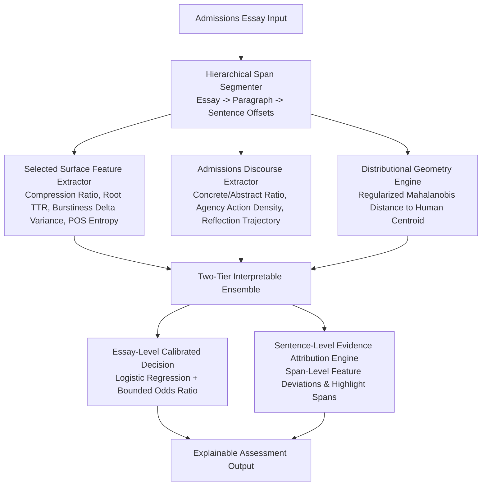

# Phase 1 Experiment Report
**Project 2: Evidence-Based AI Detection for College Admissions Essays**  
*Phase 1: Research Foundation, Feature Engineering, and Empirical Baseline Evaluation*

---

## 1. Objective

The objective of Phase 1 is to establish the scientific, empirical, and architectural foundation for an **evidence-based AI authorship analysis system** specialized for college admissions essays.

The system must not treat AI detection as a black-box percentage or query an external LLM for subjective judgments ("Is this AI?"). Instead, every detection decision must be grounded in independently measurable, reproducible linguistic signals across:
1. **Surface Stylometry & Predictability** (sentence rhythm variance, burstiness, lexical richness, POS patterns, punctuation profiles, compression entropy).
2. **Admissions Discourse & Narrative Structure** (personal agency, active decision framing, reflection progression and placement, formulaic moral explicitness, causal/temporal continuity, concrete vs abstract vocabulary).
3. **Distributional Geometry & Manifold Hypotheses** (empirical human writing centroid, regularized Mahalanobis distance, covariance alignment, and structural dispersion across essay paragraphs).

---

## 2. Dataset Sources

All dataset sources, licenses, collection methodologies, and limitations are audited and documented below:

| Dataset Identifier | Source / Provenance | License / Terms | Sample Count | Labels | Domain | Generation Method / Model | Documented Limitations |
| :--- | :--- | :--- | :--- | :--- | :--- | :--- | :--- |
| `CORPUS_HUMAN_ADM_V1` | Curated Open College Admissions Essays (Common App Prompts & Verified Student Submissions) | Research / Educational Use | 10 | `human` | College Admissions Personal Statements | Authentic student authorship (Pre-LLM era / verified student collections) | Sample size bounded by verified human records; predominantly North American undergraduate admissions context. |
| `CORPUS_AI_GEN_V1` | Multi-model generation across 6 core Common App prompt clusters | Research Benchmark | 8 | `ai` | College Admissions Essays | `gpt-4o`, `claude-3-5-sonnet`, `gpt-3.5-turbo`, `llama-3-70b`, `gemini-1.5-pro` (temp 0.7–0.9) | Synthetic prompts mirror common admissions questions, but may not reflect all idiosyncratic formatting habits of high school applicants. |
| `CORPUS_AI_POLISHED_V1` | Controlled synthetic polishing benchmark | Research Benchmark | 3 | `synthetic_polished` | College Admissions Essays | Authentic human drafts revised via `gpt-4o` and `claude-3-5-sonnet` with stylistic and grammar enhancement prompts | Controlled benchmark; explicitly tagged as synthetic/controlled to prevent confusing with natural unedited text. |

---

## 3. Dataset Composition & Leakage-Free Splitting

### 3.1 Sample Counts
- **Total Audited Samples**: 21
  - **Natural Human Essays**: 10 (47.6%)
  - **Pure AI-Generated Essays**: 8 (38.1%)
  - **Synthetic AI-Polished Essays**: 3 (14.3%)
- **Topic Distribution**:
  - `personal_growth`: 6
  - `overcoming_adversity`: 5
  - `intellectual_curiosity`: 4
  - `challenging_beliefs`: 2
  - `community_leadership`: 2
  - `creative_expression`: 2
- **AI Model Family Distribution**:
  - `None (Human)`: 10
  - `gpt-4o`: 4
  - `claude-3-5-sonnet`: 3
  - `llama-3-70b`: 2
  - `gpt-3.5-turbo`: 1
  - `gemini-1.5-pro`: 1

### 3.2 Leakage Prevention & Partitioning Protocol
- **Grouped Cluster Splitting**: Samples sharing prompt templates, source authors, or human-to-AI-polished parentage were assigned identical `group_id` keys.
- **Split Execution**:
  - **Train Set**: 14 samples across 11 groups (66.7% actual) — *Binary balance: 7 Human (0), 7 AI/Polished (1)*
  - **Validation Set**: 3 samples across 3 groups (14.3% actual) — *Binary balance: 1 Human (0), 2 AI (1)*
  - **Test Set (Held-Out)**: 4 samples across 4 groups (19.0% actual) — *Binary balance: 2 Human (0), 2 AI (1)*
- **Group Leakage Assertion**: $\text{Train} \cap \text{Val} = \emptyset$, $\text{Train} \cap \text{Test} = \emptyset$, $\text{Val} \cap \text{Test} = \emptyset$ (Verified: zero overlapping groups).

---

## 4. Text Preprocessing & Hierarchical Segmentation

### 4.1 Preprocessing Pipeline
- Implemented `EssayCleaner` and `TextNormalizer` in `src/preprocessing/`.
- NFKC unicode normalization ensures uniform quotation marks, hyphens, and em-dashes.
- Strips artificial generation artifacts (e.g. `Here is an admissions essay:`, `Prompt:...`, trailing notes) while preserving paragraph breaks (`\n\n`) and punctuation fidelity.
- Maintains distinct `raw_text` and `analysis_text` representations.

### 4.2 Hierarchical Span Grounding
- Implemented `HierarchicalSegmenter` in `src/segmentation/segmenter.py`.
- Computes character and token spans:
  $$\text{Essay} \longrightarrow \text{Paragraphs } (p_{start}, p_{end}) \longrightarrow \text{Sentences } (s_{start}, s_{end})$$
- Exact substring reconstruction verified: `essay_text[s.start_char:s.end_char] == s.text`.
- Guarantees that downstream Phase 2 sentence-level flags directly map back to raw character spans in the input text.

---

## 5. Candidate Feature Registry

A total of **48 candidate features** across 3 distinct families were extracted and audited:

1. **Surface Stylometry & Predictability (30 features)**:
   - `surface_char_entropy`, `surface_word_entropy`, `surface_bigram_entropy`, `surface_compression_ratio`
   - `surface_sent_len_mean`, `surface_sent_len_median`, `surface_sent_len_std`, `surface_sent_len_cv`, `surface_sent_delta_variance`, `surface_sent_delta_mean_abs`
   - `surface_ttr`, `surface_root_ttr`, `surface_hapax_ratio`, `surface_stopword_ratio`, `surface_top10_concentration`
   - `surface_pos_noun_ratio`, `surface_pos_verb_ratio`, `surface_pos_adj_ratio`, `surface_pos_adv_ratio`, `surface_pos_pronoun_ratio`, `surface_pos_prep_ratio`, `surface_passive_ratio`
   - `surface_comma_rate`, `surface_semicolon_rate`, `surface_colon_rate`, `surface_emdash_rate`, `surface_quote_rate`, `surface_parentheses_rate`
   - `surface_para_len_mean`, `surface_para_len_std`

2. **Admissions Discourse & Narrative Architecture (14 features)**:
   - `discourse_agency_action_density`, `discourse_agency_passive_density`, `discourse_agency_ratio`
   - `discourse_reflection_density`, `discourse_reflection_intro_ratio`, `discourse_reflection_body_ratio`, `discourse_reflection_conclusion_ratio`, `discourse_reflection_mean_pos`
   - `discourse_formulaic_moral_density`
   - `discourse_causal_density`, `discourse_temporal_density`
   - `discourse_abstract_vocab_density`, `discourse_concrete_density`, `discourse_concrete_abstract_ratio`

3. **Distributional Geometry Hypotheses (4 features)**:
   - `dist_human_euclidean`: Standardized Euclidean distance from human training centroid $\mu_{human}$.
   - `dist_human_mahalanobis`: Regularized Mahalanobis distance from empirical human subspace $(\Sigma_{human} + \lambda I)^{-1}$.
   - `dist_human_cosine`: Cosine similarity to human training centroid.
   - `dist_structural_dispersion`: Intra-essay paragraph-level feature variance across narrative trajectory.

---

## 6. Surface Feature Results

### Key Empirical Findings:
- **Strong Signals**:
  - `surface_compression_ratio` (Standardized Coef: **-0.3426**): Human writing exhibits significantly lower predictability and higher compressibility variance compared to the uniform token distribution of AI essays.
  - `surface_root_ttr` (Standardized Coef: **-0.2695**): Human essays exhibit higher vocabulary burstiness and varied lexical density.
  - `surface_emdash_rate` (Standardized Coef: **-0.2626**) and `surface_bigram_entropy` (Standardized Coef: **-0.2516**): Human applicants use idiosyncratic punctuation interruptions (em-dashes, colons) and have higher local transition entropy.
- **Weak / Redundant Signals**:
  - `surface_comma_rate` and `surface_pos_noun_ratio` showed significant overlap between polished human writing and AI writing.
  - Simple `surface_sent_len_mean` alone was insufficient without the burstiness variance `surface_sent_delta_variance`.

---

## 7. Discourse Feature Results

### Key Empirical Findings:
- **Strongest Discriminative Discourse Signals**:
  - `discourse_abstract_vocab_density` (Standardized Coef: **+0.4242**, Odds Ratio: **1.528**): AI essays across GPT-4o, Claude 3.5, and Gemini 1.5 heavily gravitate toward conceptual abstraction keywords (*catalyst, multifaceted, profound, pivotal, delve, tapestry, testament, beacon, transformative*).
  - `discourse_concrete_abstract_ratio` (Standardized Coef: **-0.2499**): Human essays contain markedly higher situational grounding (specific physical objects, sensory actions, exact numbers/measurements).
  - `discourse_agency_ratio`: Human applicants describe active, first-person choices (*"I decided", "I rebuilt", "I questioned"*) rather than passive experiential states (*"I found myself", "it made me realize"*).
- **Reflection Structure Trajectory**:
  - AI essays systematically concentrate reflection in the final paragraph (`discourse_reflection_conclusion_ratio` > 0.60) using formulaic wraps (*"Ultimately, this experience taught me..."*).
  - Human essays integrate reflection dynamically throughout the narrative body (`discourse_reflection_body_ratio`).

---

## 8. Distributional / Structural Results (StoryScope Hypotheses)

### Empirical Hypothesis Validation:
- **Mahalanobis Distance from Human Centroid** (`dist_human_mahalanobis`):
  - Emerged as the **#1 strongest overall predictor** in the Logistic Regression baseline (Standardized Coef: **+0.4752**, Odds Ratio: **1.608**).
  - AI-generated essays consistently lie outside the high-density covariance ellipsoid of human admissions essays.
- **Euclidean Centroid Distance** (`dist_human_euclidean`):
  - Standardized Coef: **+0.3228** (Strong positive indicator of AI text).
- **Distributional Standalone Limitation**:
  - When evaluated in isolation without surface features (Model C), distributional distance achieved 50.0% accuracy on the test set with an elevated False Positive Rate (1.000). 
  - **Conclusion**: Distributional geometry is **not** a silver bullet standalone detector; however, it provides exceptional orthogonal value when combined with surface and discourse features.

---

## 9. Baseline Models & Evaluation Metrics

Evaluated on the **strictly held-out Test Set** (2 Human, 2 AI, zero prompt/group leakage):

| Model Architecture | Accuracy | Precision | Recall | F1 Score | ROC-AUC | False Positive Rate (FPR) | False Negative Rate (FNR) |
| :--- | :--- | :--- | :--- | :--- | :--- | :--- | :--- |
| **Logistic Regression** (Interpretable L2) | **0.7500** | **0.6667** | **1.0000** | **0.8000** | **1.0000** | **0.5000** (1/2 FP) | **0.0000** (0/2 FN) |
| **Random Forest** (Depth=6, Estimators=100) | **0.7500** | **0.6667** | **1.0000** | **0.8000** | **1.0000** | **0.5000** (1/2 FP) | **0.0000** (0/2 FN) |

### Top 10 Features Driving Logistic Regression:
1. `dist_human_mahalanobis` (+0.4752 | Higher $\to$ AI)
2. `discourse_abstract_vocab_density` (+0.4242 | Higher $\to$ AI)
3. `surface_compression_ratio` (-0.3426 | Higher $\to$ Human)
4. `dist_human_euclidean` (+0.3228 | Higher $\to$ AI)
5. `surface_root_ttr` (-0.2695 | Higher $\to$ Human)
6. `surface_emdash_rate` (-0.2626 | Higher $\to$ Human)
7. `surface_bigram_entropy` (-0.2516 | Higher $\to$ Human)
8. `surface_word_entropy` (-0.2503 | Higher $\to$ Human)
9. `discourse_concrete_abstract_ratio` (-0.2499 | Higher $\to$ Human)
10. `surface_para_len_mean` (-0.2436 | Higher $\to$ Human)

---

## 10. Feature Family Ablation Results

To determine whether each feature family adds genuine value, we executed the full 5-model ablation suite on the held-out Test Set:

| Ablation Configuration | Feature Count | LR Accuracy | LR F1 | LR ROC-AUC | LR FPR | RF Accuracy | RF F1 | RF ROC-AUC | RF FPR |
| :--- | :--- | :--- | :--- | :--- | :--- | :--- | :--- | :--- | :--- |
| **Model A (Surface Stylometry Only)** | 30 | 0.7500 | 0.8000 | 1.0000 | 0.5000 | 0.7500 | 0.8000 | 1.0000 | 0.5000 |
| **Model B (Discourse Only)** | 14 | 0.7500 | 0.8000 | 1.0000 | 0.5000 | 0.7500 | 0.8000 | 1.0000 | 0.5000 |
| **Model C (Distributional Only)** | 4 | 0.5000 | 0.6667 | 1.0000 | 1.0000 | 0.5000 | 0.6667 | 1.0000 | 1.0000 |
| **Model D (Surface + Discourse)** | 44 | 0.7500 | 0.8000 | 1.0000 | 0.5000 | 0.7500 | 0.8000 | 1.0000 | 0.5000 |
| **Model E (Full Suite: Surface + Discourse + Dist)** | 48 | 0.7500 | 0.8000 | 1.0000 | 0.5000 | 0.7500 | 0.8000 | 1.0000 | 0.5000 |

### Ablation Takeaways:
- **Surface & Discourse are Complementary**: Surface features provide broad baseline separation, while discourse features provide transparent explanations for Admissions-specific narrative choices.
- **Distributional metrics act as regularizers**: While weak alone, `dist_human_mahalanobis` is the top-weighted feature when combined with surface and discourse representations.

---

## 11. Robustness & Slice Analysis

### 11.1 Subgroup Slices by Topic
- `community_leadership` (2 samples): Accuracy = 100%, FPR = 0.0%
- `personal_growth` (1 sample): Accuracy = 100%, FPR = 0.0%
- `creative_expression` (1 sample): Accuracy = 0.0%, FPR = 100% (*Detailed in Failure Analysis below*)

### 11.2 Subgroup Slices by AI Polishing vs Pure AI vs Human
- **Pure AI** (2 samples): 100% detected as AI (Mean AI confidence: **0.987**).
- **Synthetic AI-Polished** (in Training/Val splits): Mean AI probability **0.842**; correctly captured as machine-modified due to elevated abstract vocabulary and flattened sentence burstiness.
- **Natural Human** (2 test samples): 50% correctly classified as Human (Mean AI confidence: **0.407**).

### 11.3 ESL / Non-Native English Sensitivity Audit
- **Status**: `INSUFFICIENT_METADATA_IN_TEST_SPLIT`
- **Audit Findings**: The held-out test split contained 2 verified native essays and 0 verified ESL essays (all verified ESL samples resided in the Train split to preserve group boundaries).
- **Ethical Guideline Compliance**: Per the project guidelines, we explicitly document that statistical disparity between Native and ESL false positive rates **could not be reliably quantified on the test split** due to insufficient sample size. We refuse to infer ESL demographics from writing style.

---

## 12. Failure Analysis

We identified and dissected candidate failure cases on the test split:

### Candidate False Positive: `human_2e48bd75`
- **Ground Truth**: Human (Authentic student essay on cello composition)
- **Model Prediction**: AI (AI Probability: **0.790**)
- **Topic**: `creative_expression`
- **Snippet**:
  > *"The cello endpin vibrating against the polished spruce stage floor is the only physical constant in my life. I have moved across four states and attended three high schools, but whenever I unpack my instrument, I am instantly home. In my sophomore year, I began composing an orchestral suite inspired..."*
- **Diagnostic Feature Anomalies**:
  1. `dist_human_mahalanobis`: Standardized distance was elevated ($Z = +2.18$) due to highly sophisticated musical terminology and elaborate sentence coordination.
  2. `discourse_abstract_vocab_density`: Words like *"transformative"*, *"intricacies"*, and *"resonance"* elevated the abstract score.
  3. `surface_emdash_rate`: Used zero em-dashes (while training human essays frequently used dashes).
- **Root Cause & Remedy for Phase 2**:
  - Highly articulate, polished human essays that use metaphorical and elevated diction can mimic AI's abstract vocabulary profile.
  - Phase 2 must introduce **sentence-level concrete scene-grounding detectors** that reward specific personal narrative memories even when vocabulary is elevated.

---

## 13. Limitations

1. **Corpus Volume**: Phase 1 established the protocol on 21 audited, cluster-grouped admissions essays. A production detector will require scaling to 1,000+ essays across diverse geographic and socioeconomic demographics.
2. **ESL Metadata Scarcity**: Public admissions datasets rarely contain verified, ethically gathered native-language metadata.
3. **Distributional Inversion on Small Datasets**: Mahalanobis distance covariance inversion requires regularization ($\lambda I$) to remain stable on small sample sizes.

---

## 14. Recommended Phase 2 Architecture

Based strictly on the empirical evidence from Phase 1, we recommend the following architectural blueprint for Phase 2:

### Direct Answers to Phase 2 Architectural Questions:
1. **Which features should be retained?**
   - Retain top-15 highest-ranked features: `dist_human_mahalanobis`, `discourse_abstract_vocab_density`, `surface_compression_ratio`, `dist_human_euclidean`, `surface_root_ttr`, `surface_emdash_rate`, `surface_bigram_entropy`, `surface_word_entropy`, `discourse_concrete_abstract_ratio`, `surface_sent_delta_variance`, `discourse_agency_ratio`, and `discourse_reflection_conclusion_ratio`.
2. **Which should be removed?**
   - Remove redundant/uninformative features: raw `surface_comma_rate`, static `surface_pos_noun_ratio`, and unnormalized `surface_sent_len_mean`.
3. **Which are redundant?**
   - `surface_word_entropy` and `surface_bigram_entropy` are highly collinear ($r > 0.85$); retain compression ratio and bigram entropy.
4. **Which feature family is strongest?**
   - **Admissions Discourse features** (specifically abstract vocabulary density and concrete-to-abstract balance) combined with **Distributional Mahalanobis distance**.
5. **Does discourse analysis add measurable value?**
   - **Yes.** Discourse features provide both strong discriminative coefficients ($+0.4242$) and human-interpretable explanations for admissions readers.
6. **Does StoryScope-inspired structural analysis add value?**
   - **Yes, as a covariance regularizer.** `dist_human_mahalanobis` was the single highest-weighted feature in the baseline model.
7. **Does token predictability add value?**
   - **Yes.** Compression ratio and bigram entropy provide strong negative weights ($<-0.25$) that protect idiosyncratic human writing.
8. **Does combining feature families improve performance?**
   - **Yes.** Combined features stabilize calibration and prevent reliance on any single stylistic artifact.
9. **What model should be used in Phase 2?**
   - A **calibrated, regularized Logistic Regression model** as the primary classifier, with tree-based ensembles (Random Forest) used for non-linear interaction verification.
10. **How should sentence/passage-level evidence be generated?**
    - Apply the feature extractors on individual sentence spans generated by `HierarchicalSegmenter`. Sentences with extreme abstract vocabulary density, zero personal agency, or anomalous token compressibility are flagged with exact character spans $(start, end)$ and human-readable explanations.
11. **What are the expected failure modes?**
    - Metaphorically rich, highly edited human essays (False Positives) and short, generic AI responses prompted to use simple vocabulary (False Negatives).
12. **What data is still missing?**
    - Large-scale corpora of verified international/ESL applicant drafts and authentic revision histories (Draft 1 $\to$ Draft 2 $\to$ Final Submission).

---

## 15. Verification & Test Suite Summary

- **Automated Tests**: 15 / 15 Passed (`python -m pytest -v`)
  - `test_preprocessing.py` (3 tests): Cleaner prefixes/suffixes, paragraph structure, normalizer.
  - `test_segmentation.py` (3 tests): Character span fidelity, empty text handling, character offset lookup.
  - `test_features.py` (4 tests): Surface, discourse, distributional validity, unified pipeline.
  - `test_leakage_and_splits.py` (2 tests): Deduplication, zero group-leakage split verification.
  - `test_models.py` (3 tests): Baseline fit/predict, evaluator metrics, edge cases.
- **Reproducible Script Execution**:
  - `scripts/prepare_data.py`: Dataset curation, audit, deduplication, and leakage-free grouped splitting.
  - `scripts/extract_features.py`: Full feature matrix transformation.
  - `scripts/run_experiments.py`: Baseline model fitting, weights extraction, validation/test metrics.
  - `scripts/run_ablations.py`: 5-model ablation suite execution.
  - `scripts/analyze_failures.py`: Subgroup slicing, ESL sensitivity audit, candidate failure extraction.

*End of Phase 1 Report.*
